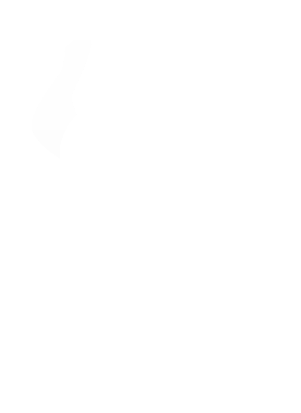

## Table of Contents
- [Introduction](#introduction)
- [Technologies](#technologies)
- [Set Up](#set-up)
- [Deployment Link](#deployment-link)
- [Features](#features)
- [Future Features](#future-features)
- [Contributors](#contributors)
- [Project Specifications](#project-specifications)

### Introduction

**Birds of A Feather** Connecting LGBTQ+ Families

### Technologies
- JavaScript(ES6)
- React
- Context API
- Cypress
- React-Router
- Circle CI
- HTML
- CSS

### Set Up
1. Clone this [repository](https://github.com/Feather-Flock/birds-ui).
2. `cd` into the directory.
3. Run `npm i install`.
4. Run `npm start`.

### Deployment Link

Checkout the website [here](http://www.birds-of-a-feather.net/)

### Features
- User see the events coming up in their area

### Future Features

### Contributors
Frontend Team:
- [Trish Fox-Collins](https://github.com/tfoxcollis)[LinkedIn](https://www.linkedin.com/in/trish-fox-collis/)
- [Amber Bodnar](https://github.com/abodnar1)[LinkedIn](https://www.linkedin.com/in/amberbodnar/)
- [Blue Nealis](https://github.com/BlueNealis/)[LinkedIn](https://www.linkedin.com/in/blue-nealis/)
Backend Team:
- [Clay Ash](https://github.com/clayAsh)[LinkedIn](https://www.linkedin.com/in/clay-ash-b4422b188/)
- [Deannah Burke](https://github.com/deannahburke)[LinkedIn](linkedin.com/in/deannah-burke/)
- [Luke Pascale](https://github.com/enalihai)[LinkedIn](https://www.linkedin.com/in/luke-pascale/)
- [Ian Ross](https://github.com/ross-ian28)[LinkedIn](https://www.linkedin.com/in/ross-ian28/)

### Project Specifications
- Project specs are located [here](https://mod4.turing.edu/projects/capstone/).
