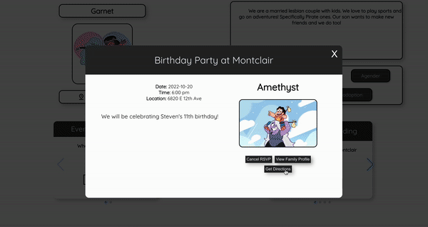

# Birds of a Feather
View the deployed site [here](https://birds-ui.vercel.app/).
 
 

## Table of Contents
- [Project Overview](#project-overview)
- [Learning Goals](#learning-goals)
- [Technologies and Tools](#technologies-and-tools)
- [Project Reflections](#project-reflections)
- [Roadmap](#roadmap)
- [Setup](#setup)
- [Contributors](#contributors)
- [Sources](#sources)

## Project Overview
Welcome to Birds of a Feather! The goal of this app is to connect LGBTQ+ families through events in their area.

### Features
 - Users can search their area for events with other LGBTQ+ families using a visual map
 - Users can click on event cards or location icons to see more details about the event
 - Users can RSVP from the modal or view the host family's information
 - Users can make their own events from the new event page
 - Users can ensure they have the right address with the visual of the interactive maps
 - Users can delete their own events from their user profile
 - Users can edit their profile description
 - Users can add new tags to their profile detailing communities of the LGBTQ + they belong to
 - User can update their Denver zipcode and username

*Change Range of Events*

*Navigate to user Profile from event*

*Fill out and submit a new event*

*Edit User profile*

*Rsvp to event from event modal*

*List View*

*Get directions to event*

## Learning Goals
* Demonstrate knowledge you’ve gained throughout Turing
* Use an agile process to turn well defined requirements into deployed and production ready software
* Gain experience dividing applications into components and domains of responsibilities to facilitate multi-developer teams. Service oriented architecture concepts and patterns are highly encouraged.
* Explore and implement new concepts, patterns, or libraries that have not been explicitly taught while at Turing
* Practice an advanced, professional git workflow including a Pull Request Review
* Gain experience using continuous integration tools to build and automate the deployment of features
* Build applications that execute in development, test, CI, and production environments
* Focus on communication between front-end and back-end teams in order to complete and deploy features that have been outlined by the project spec

## Technologies and Tools

Context API

## Project Reflections
#### Wins
* Getting interactive maps on both the dashboard and the event form
* Having users be able to look at the host family profile of different events

#### Challenges
* The event modal proved challenging for certain rendering capabilities (map)
* CircleCI sometimes had confusing errors and there is definitely still fuzziness surrounding it.

## Roadmap
Future features could include:
* Allow users to message each other about events
* Users get an email notification when they RSVP or when someone rsvps to their event
* Users can see who has rsvpd to their event and navigate to their profile

## Setup
1. Fork this Repo
2. Clone it down to your machine
3. `cd` into the root of the project directory
4. Run `npm install`
5. Run `npm start`

For Cypress Testing:
1. Run `npm run cypress`
2. Follow the prompts in the browser and select the spec file you want to run

## Contributors
**Trish Fox-Collis (She/Her)**
* [LinkedIn](https://www.linkedin.com/in/trish-fox-collis/)
* [GitHub](https://github.com/tfoxcollis)

**Blue Nealis (They/Them)**
* [LinkedIn](https://www.linkedin.com/in/blue-nealis/)
* [GitHub](https://github.com/BlueNealis)

**Amber Bodnar (She/Her)**
* [LinkedIn](https://www.linkedin.com/in/amberbodnar/)
* [GitHub](https://github.com/abodnar1)

## Sources
* [Cypress](https://docs.cypress.io/guides/overview/why-cypress)
* [Scrimba](https://scrimba.com/dashboard#overview)
* [GraphQL Cypress Tutorial](https://www.jayfreestone.com/writing/stubbing-graphql-cypress/)

*A [Turing School of Software and Design](https://turing.edu/) Module 4 Capstone Full-Stack Project. The project overview can be found [here](https://mod4.turing.edu/projects/capstone/).*
